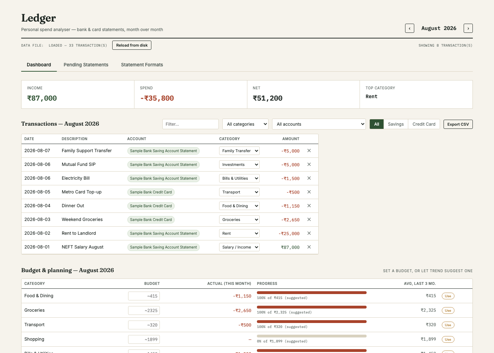
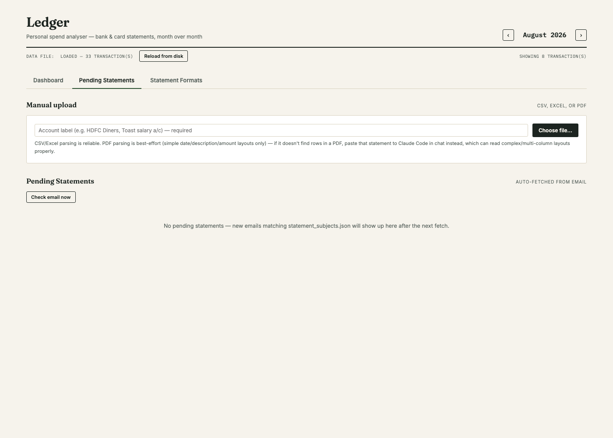
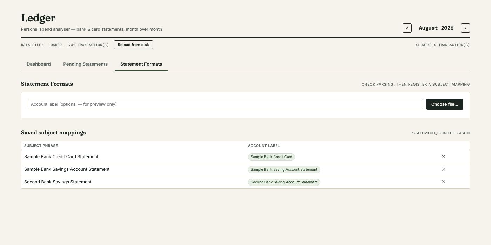

# Spend Analyser

Upload your bank/credit-card statements and it auto-categorizes every
transaction into one CSV ledger, with a local dashboard for monthly
summaries, category charts, spend trends, and budgets.

## Get started

Steps 1–2 are one-time. After that, starting it up again is just step 3.

**1. Install dependencies**

```
python3 -m venv .venv
.venv/bin/pip install -r requirements.txt
```

**2. Set up your personal config** — these 3 files aren't included (they'd
be specific to someone else's accounts, not yours):

```
cp category_rules.example.json category_rules.json
cp statement_subjects.example.json statement_subjects.json
cp mail_config.example.json mail_config.json
```

Open `category_rules.json` and add your own name under `"Self Transfer"` (so
moving money between your own accounts gets recognized), and anyone else you
regularly send/receive money from under `"Family Transfer"` or
`"Settlement"`. You can skip `statement_subjects.json` and `mail_config.json`
for now — they're only needed later for the optional email auto-fetch.

**3. Start the server**

```
.venv/bin/python3 server.py
```

**4. Open the dashboard** — http://127.0.0.1:8765/

**5. Upload your first statement** — go to the **Pending Statements** tab →
**Manual upload** → type an account label (must end in `"Credit Card"` or
`"Saving Account Statement"`, e.g. `"HDFC Saving Account Statement"`) → choose
your file. CSV, Excel (`.xlsx`/`.xls`), and PDF are all supported; encrypted
files will prompt for a password.

That's it — the **Dashboard** tab now shows your transactions. `Ctrl+C` in
the terminal stops the server; run step 3 again any time to bring it back.

## The three tabs

*(Screenshots below use made-up sample data, not a real ledger.)*

**Dashboard** — monthly summary (income/spend/net/top category), the full
transactions table (searchable, filterable by category/account/Savings-vs-
Credit-Card), a budget planner, a backup button, and spend charts. Pick a
category in the filter to see its monthly trend and which account it went
through.



**Pending Statements** — upload a file yourself, or (if you set up the email
auto-fetch) review statements it found automatically before they're added to
the ledger.



**Statement Formats** — test whether a file parses correctly *before*
committing to it. If it can't be read, it hands you the raw text and a
button to copy it into a Claude Code chat to get support added.



## Categories

Every category is one of three types:

- **Income** — `Salary / Income`, `Dividend`, `Cashback`.
- **Ignored** — `Self Transfer`, `Family Transfer`. Still visible in the
  table, but left out of every total and chart, since moving money to
  yourself or family isn't real spend or income. Edit `IGNORED_CATEGORIES`
  in `spend_analyser.html` to change which categories this applies to.
- **Spend** — everything else (`Food & Dining`, `Groceries`, `Rent`, `Bills &
  Utilities`, etc. — the full list is in `category_rules.json`).

A refund or reversal inside a spend category (e.g. a bounced autopay coming
back as a credit) reduces that category's total instead of being ignored or
counted as income.

## Optional: fetch statements from email automatically

Only worth doing if your bank emails you a statement each month/cycle.

1. Finish the `statement_subjects.json` and `mail_config.json` setup from
   step 2 above — the latter needs a Gmail address and an app-specific
   password (generate one at myaccount.google.com/apppasswords, requires
   2-Step Verification).
2. Click **Check email now** on the Pending Statements tab any time you want
   to fetch on demand.
3. For it to also run automatically every morning (macOS only):
   ```
   cp com.spendanalyser.fetchstatements.plist.example \
      ~/Library/LaunchAgents/com.spendanalyser.fetchstatements.plist
   ```
   Edit that copy and replace every `/ABSOLUTE/PATH/TO/spend-analyser` with
   this project's real path (`pwd` will tell you), then:
   ```
   launchctl load ~/Library/LaunchAgents/com.spendanalyser.fetchstatements.plist
   ```
   To stop it later: `launchctl unload` the same path.

## Good to know

- Two kinds of transactions never make it into the ledger, by design: those
  matching `EXCLUDE_KEYWORDS` in `server.py` (self-repayment, e.g. paying
  your own credit card from your own bank account — not real spend), and
  anything a parser couldn't confidently read.
- Budgets live in the browser's `localStorage`, not in `transactions.csv` —
  they don't travel with a CSV backup and are per-browser.
- The server only binds `127.0.0.1` (this machine only) by default, and
  there's no login anywhere in this app — if you turn on LAN access
  (`host="0.0.0.0"` in `server.py`), anyone on that network can view and
  edit your ledger, so only do that on a trusted home network.
- PDF parsing only understands the bank/card layouts it's already seen —
  anything new needs the Statement Formats tab's "copy for Claude" flow.
  CSV/Excel upload works for any file regardless of bank.
- A few statements have no real text layer at
  all — every line is a raster image — so they need OCR instead. That
  needs one extra one-time install: `brew install tesseract` (macOS).
  Without it, those PDFs are just treated as an unrecognized format like
  any other.
- The email fetcher only looks back `search_window_days` (default 1) days —
  if your computer is asleep across a multi-day gap at fetch time, an email
  could be missed. Use "Check email now" if you suspect that happened.

Implementation details (PDF format detection, file-by-file breakdown, etc.)
live in `CLAUDE.md`, aimed at whoever (human or AI) is extending this code
rather than at day-to-day use.
